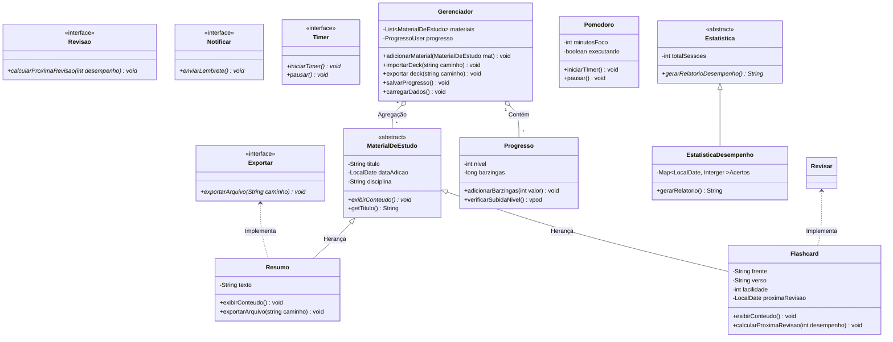

```mermaid
classDiagram
    class Revisao {
        <<interface>>
        +calcularProximaRevisao(int desempenho)* void
    }
    class Exportar{
        <<interface>>
        +exportarArquivo(String caminho)* void
    }
    class Notificar{
        <<interface>>
        +enviarLembrete()* void
    }
    class Timer {
        <<interface>>
        +iniciarTimer()* void
        +pausar()* void
    }
    %% Classes Abstratas
    class MaterialDeEstudo {
        <<abstract>>
        -String titulo
        -LocalDate dataAdicao
        -String disciplina
        +exibirConteudo()* void
        +getTitulo() String
    }

    class Estatistica {
        <<abstract>>
        -int totalSessoes
        +gerarRelatorioDesempenho()* String
    }

    %% Classes Concretas
    class Flashcard {
        -String frente
        -String verso
        -int facilidade
        -LocalDate proximaRevisao
        +exibirConteudo() void
        +calcularProximaRevisao(int desempenho) void
    }

    class Resumo{
        -String texto
        +exibirConteudo() void
        +exportarArquivo(string caminho) void
    }

    class Progresso {
        -int nivel
        -long barzingas
        +adicionarBarzingas(int valor) void
        +verificarSubidaNivel() vpod
    }

    class Pomodoro{
        -int minutosFoco
        -boolean executando
        +iniciarTImer() void
        +pausar() void
    }

    class EstatisticaDesempenho{
        -Map~LocalDate, Interger ~Acertos
        +gerarRelatorio() String
    }

    class Gerenciador{
        -List~MaterialDeEstudo~ materiais
        -ProgressoUser progresso
        +adicionarMaterial(MaterialDeEstudo mat) void
        +importarDeck(string caminho) void
        +exportar deck(string caminho) void
        +salvarProgresso() void
        +carregarDados() void
    }

    %% Relacionamentos
    MaterialDeEstudo <|-- Flashcard : Herança
    MaterialDeEstudo <|-- Resumo : Herança
    Estatistica <|-- EstatisticaDesempenho
    Revisar <.. Flashcard : Implementa
    Exportar <.. Resumo : Implementa
    Gerenciador "1" o-- "*" Progresso : Contém
    Gerenciador "1" o-- "*" MaterialDeEstudo : Agregação
```
