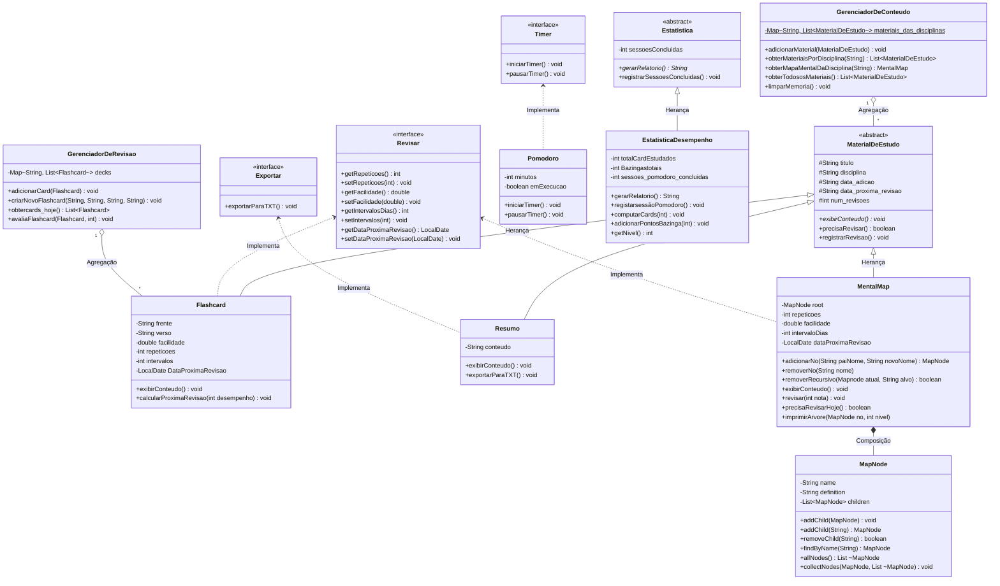

# MC322-Projeto_final
Projeto da disciplina MC322 1s2026 dos alunos Guilherme Arthur, Mariana Fonsechi, Victória Leite e Vitor Ribeiro Lima.

```mermaid
classDiagram
    class Revisar {
        <<interface>>
        +getRepeticoes() int
        +setRepeticoes(int) void
        +getFacilidade() double
        +setFacilidade(double) void
        +getIntervalosDias() int
        +setIntervalos(int) void
        +getDataProximaRevisao() LocalDate
        +setDataProximaRevisao(LocalDate) void
    }
    
    class Exportar{
        <<interface>>
        +exportarParaTXT() void
    }
    
    class Timer {
        <<interface>>
        +iniciarTimer() void
        +pausarTimer() void
    }

    %% Classes Abstratas
    class MaterialDeEstudo {
        <<abstract>>
        #String titulo
        #String disciplina
        #String data_adicao
        #String data_proxima_revisao
        #int num_revisoes
        +exibirConteudo()* void
        +precisaRevisar() boolean
        +registrarRevisao() void
    }

    class Estatistica {
        <<abstract>>
        -int sessoesConcluidas
        +gerarRelatorio()* String
        +registrarSessoesConcluidas() void
    }

    %% Classes Concretas (Modelos)
    class Flashcard {
        -String frente
        -String verso
        -double facilidade
        -int repeticoes
        -int intervalos
        -LocalDate DataProximaRevisao
        +exibirConteudo() void
        +calcularProximaRevisao(int desempenho) void
    }

    class Resumo{
        -String conteudo
        +exibirConteudo() void
        +exportarParaTXT() void
    }

    class MentalMap {
        -MapNode root
        -int repeticoes
        -double facilidade
        -int intervaloDias
        -LocalDate dataProximaRevisao
        +adicionarNo(String paiNome, String novoNome) MapNode
        +removerNo(String nome)
        +removerRecursivo(Mapnode atual, String alvo) boolean
        +exibirConteudo() void
        +revisar(int nota) void
        +precisaRevisarHoje() boolean
        +imprimirArvore(MapNode no, int nivel)
    }

    class MapNode {
        -String name
        -String definition
        -List~MapNode~ children
        +addChild(MapNode) void
        +addChild(String) MapNode
        +removeChild(String) boolean
        +findByName(String) MapNode
        +allNodes() List ~MapNode
        +collectNodes(MapNode, List ~MapNode) void
    }

    class Pomodoro{
        -int minutos
        -boolean emExecucao
        +iniciarTimer() void
        +pausarTimer() void
    }

    class EstatisticaDesempenho{
        -int totalCardEstudados
        -int Bazingastotais
        -int sessoes_pomodoro_concluidas
        +gerarRelatorio() String
        +registarsessãoPomodoro() void
        +computarCards(int) void
        +adicionarPontosBazinga(int) void
        +getNivel() int
    }

    %% Classes Gerenciadoras (Lógica)
    class GerenciadorDeConteudo{
        -Map~String, List~MaterialDeEstudo~~ materiais_das_disciplinas$
        +adicionarMaterial(MaterialDeEstudo) void
        +obterMateriaisPorDisciplina(String) List~MaterialDeEstudo~
        +obterMapaMentalDaDisciplina(String) MentalMap
        +obterTodososMateriais() List~MaterialDeEstudo~
        +limparMemoria() void
    }

    class GerenciadorDeRevisao{
        -Map~String, List~Flashcard~~ decks
        +adicionarCard(Flashcard) void
        +criarNovoFlashcard(String, String, String, String) void
        +obtercards_hoje() List~Flashcard~
        +avaliaFlashcard(Flashcard, int) void
    }

    %% Relacionamentos e Heranças
    MaterialDeEstudo <|-- Flashcard : Herança
    MaterialDeEstudo <|-- Resumo : Herança
    MaterialDeEstudo <|-- MentalMap : Herança
    MentalMap *-- MapNode : Composição
    
    Estatistica <|-- EstatisticaDesempenho : Herança
    
    Revisar <.. Flashcard : Implementa
    Revisar <.. MentalMap : Implementa
    Exportar <.. Resumo : Implementa
    Timer <.. Pomodoro : Implementa
    
    GerenciadorDeConteudo "1" o-- "*" MaterialDeEstudo : Agregação
    GerenciadorDeRevisao "1" o-- "*" Flashcard : Agregação
```

